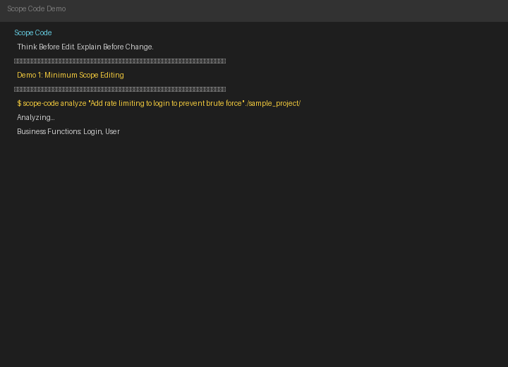

# Scope Code

[](https://github.com/lsu159/scope-code/actions/workflows/test.yml)
[](https://www.python.org/)
[](LICENSE)

> **Think Before Edit. Explain Before Change.**

A Reliable Software Engineering Agent Framework — AI must explain **why, where, and what not to change** before touching any code.

---

## Demo



*Two requirements analyzed. Only the relevant module is touched each time — unrelated code is explicitly locked.*

> Regenerate: `python generate_gif.py` (requires Pillow)

---

## What Makes This Different

```
Normal AI tools:   Request → Modify Code
Scope Code:        Request → Understand → Analyze → Infer Scope → Plan → Confirm → Modify → Verify
                                  ↑            ↑           ↑        ↑        ↑        ↑
                            Flag ambiguities   Define boundaries   You decide   Execute   Audit
```

| | Cursor / Copilot | Claude Code | Scope Code |
|---|---|---|---|
| Modifies code | ✅ | ✅ | ✅ |
| Explains WHY each file | ❌ | Partial | ✅ Evidence chain |
| Marks files NOT to touch | ❌ | ❌ | ✅ Explicit boundaries |
| Verifies scope after edits | ❌ | ❌ | ✅ Auto audit |
| Requires user confirmation | Implicit | Implicit | ✅ Explicit |
| Multi-model support | — | Anthropic only | ✅ 4 providers |

## Installation

```bash
pip install -e .
# or with CLI extras
pip install -e ".[cli]"
```

Python 3.10+.

## Quick Start

### CLI

```bash
# Plan only (no code changes)
scope-code analyze "Add rate limiting to login" ./my-project/

# Pick a model
scope-code analyze --provider deepseek --model deepseek-chat "Fix auth bug" ./src/

# Execute the plan
scope-code analyze --auto-confirm --execute "Add rate limiting to login" ./my-project/

# Dry run (preview without writing)
scope-code analyze --auto-confirm --execute --dry-run "Add refund to payment" ./my-project/

# Save reports
scope-code analyze --output plan.md --output-json plan.json "Refactor payment" ./app/

# Deterministic only (no LLM)
scope-code analyze --no-llm "Add cache" ./my-project/
```

### Python API

```python
import asyncio
from scope_code import PipelineEngine, create_llm

async def main():
    llm = create_llm(
        provider="deepseek",
        model="deepseek-chat",
        api_key="sk-your-key",
    )

    engine = PipelineEngine.create_default()
    context = await engine.run(
        requirement="Add rate limiting to login",
        project_path="./my-project/",
        llm=llm,
    )

    plan = context.modification_plan
    print(plan.format_summary())

asyncio.run(main())
```

For full 8-stage pipeline (code modification + verification):

```python
engine = PipelineEngine.create_default(include_modify=True)
```

### MCP Server (for Claude Code)

Create a `.mcp.json` in your project root:

```json
{
  "mcpServers": {
    "scope-code": {
      "command": "python",
      "args": ["-m", "scope_code.mcp_server"],
      "env": {
        "SCOPE_CODE_API_KEY": "sk-your-key",
        "SCOPE_CODE_PROVIDER": "deepseek",
        "SCOPE_CODE_MODEL": "deepseek-chat"
      }
    }
  }
}
```

Then in Claude Code: "Use scope-code to analyze adding rate limiting to login."

Three MCP tools:
- `analyze_scope` — analyze and return a modification plan with `plan_hash`
- `analyze_and_execute` — execute a plan (requires `plan_hash` from `analyze_scope`)
- `get_evidence` — get the evidence chain for a specific file

## Pipeline Stages

| # | Stage | Description | LLM |
|---|---|---|---|
| 1 | Understand | Parse NL requirement into entities, actions, constraints | Yes |
| 2 | Business Analysis | Map requirement to business functions and modules | Yes |
| 3 | Structure Analysis | Parse project: files, modules, dependency graph, call graph | No |
| 4 | **Scope Inference** | Determine must/should/must-not modify with evidence chain | Yes |
| 5 | Plan Generation | Assemble plan with risk assessment and verification steps | Yes |
| 6 | Confirmation | Present plan to user; accept, reject, or modify scope | Interactive |
| 7 | Modify | Generate and apply code changes (supports dry-run) | Yes |
| 8 | Verify | Compare actual changes vs plan, detect violations and side effects | No |

## Supported Languages

| Language | AST Parsing | Dependency Graph | Call Graph |
|---|---|---|---|
| Python | `ast` (stdlib) | Full | Full + cross-file |
| JavaScript | Regex | Full | Per-file |
| TypeScript | Regex | Full | Per-file |
| Go | Regex | Full | — |
| Rust | Regex | Full | — |
| Java | Regex | Full | — |
| Kotlin | Regex | Full | — |

## Supported Models

Framework is model-agnostic — switch models by changing one parameter.

| Provider | Models | Usage |
|---|---|---|
| DeepSeek | deepseek-chat / deepseek-reasoner | `--provider deepseek --model deepseek-chat` |
| Google Gemini | gemini-2.0-flash / gemini-2.5-pro | `--provider gemini --model gemini-2.0-flash` |
| OpenAI | gpt-4o | `--provider openai --model gpt-4o` |
| Anthropic Claude | claude-sonnet-5 / claude-opus-5 | `--provider claude --model claude-sonnet-5-20251001` |

Add a new provider:

```python
from scope_code.llm import register_provider
from my_adapters import QwenAdapter
register_provider("qwen", QwenAdapter)
```

## Example Output

```
============================================================
Modification Plan
============================================================

Requirement: Add rate limiting to login

Business Functions Affected:
  * Authentication
  * Security

MUST MODIFY (1 file):
  [modify] src/auth/__init__.py
    -> Directly implements the login function.

MUST NOT MODIFY (3 modules):
  X src/chat/* (unrelated — no dependency connection)
  X src/payment/* (unrelated — no dependency connection)
  X tests/* (unrelated — no dependency connection)

Evidence Chain (1 item):
  1. [direct] src/auth/__init__.py
     Callers: LoginController
     Directly implements the affected business function.

Risk Assessment:
  ! Rate limit too aggressive → legitimate users locked out.
  ! Per-IP vs per-user scoping needs careful consideration.

Verification Steps:
  1. Unit tests for rate limit threshold (expect 429).
  2. Confirm normal users below threshold can still log in.
  3. Run existing test suite for regressions.
============================================================
```

## Project Structure

```
scope_code/
├── models/          # Pydantic data models (Scope, Plan, Evidence, Project)
├── llm/             # LLM adapters (Claude, OpenAI, DeepSeek, Gemini)
├── analyzers/       # Deterministic analysis (AST, dependency graph, call graph, symbols)
├── pipeline/        # Pipeline engine, context, stage base class
├── stages/          # 8 pipeline stages
├── outputs/         # Markdown + JSON formatters
├── cli/             # CLI entry point
└── mcp_server.py    # MCP protocol server
```

## Status

- [x] 8-stage pipeline (understand → verify)
- [x] Scope inference with evidence chain
- [x] 4 LLM providers
- [x] 7 languages (Python, JS, TS, Go, Rust, Java, Kotlin)
- [x] Cross-file call graph resolution (Python)
- [x] MCP Server (3 tools with plan_hash verification)
- [x] Git diff integration in verification
- [x] 33 tests passing
- [x] End-to-end validated with DeepSeek

## License

MIT
